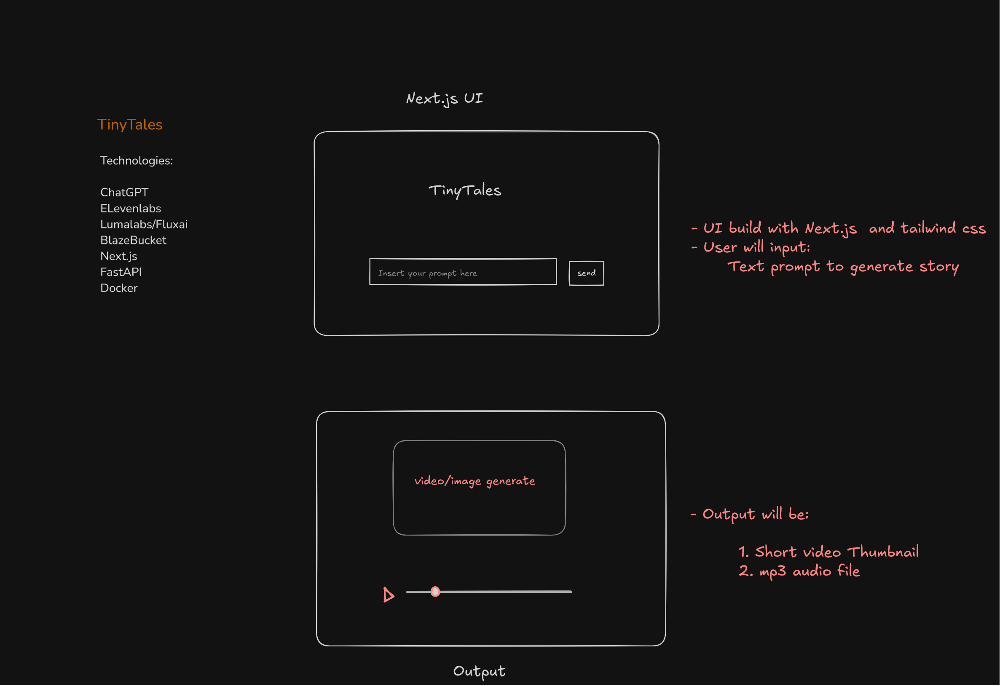
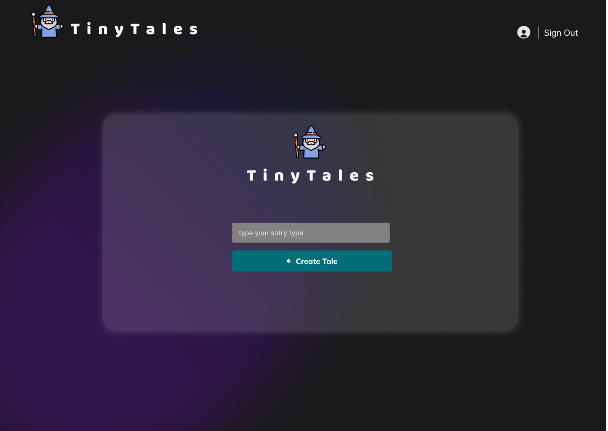
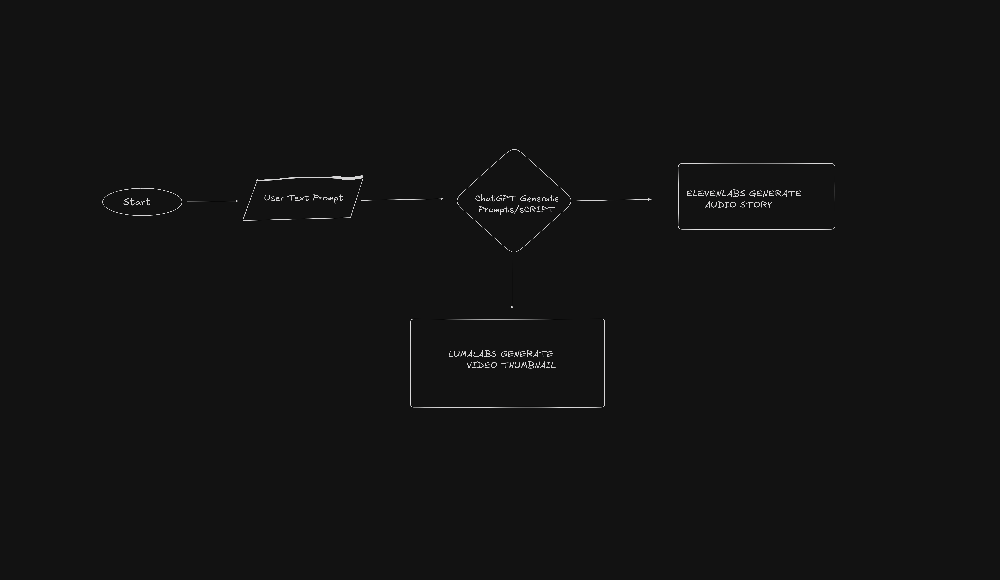

# TinyTales - AI-Powered Story Generator

**TinyTales** is an AI-powered micro-SaaS platform that generates engaging **audio stories**. Built during the lablab.ai hackathon, TinyTales leverages cutting-edge AI technologies like **ChatGPT**, **ElevenLabs** to deliver delightful storytelling experiences through a user-friendly web interface.

---

## 🚀 Key Features

- 🎙 **AI Story Generation** – Automatically generate captivating story scripts using ChatGPT.
- 🔊 **Audio Story Creation** – Convert the generated script into lifelike audio using ElevenLabs Voice AI.
- 🎞 **Image Generation** – Generate visually engaging images using FluxAI.
- 🖥 **Easy-to-Use UI** – Clean, modern interface built with Next.js and Tailwind CSS.
- 🔁 **Automation & Integration** – Orchestrated backend using FastAPI and Docker for seamless interaction between services.

---

## 🧠 Technologies Used

| Layer | Technologies |
|-------|--------------|
| **AI Services** | ChatGPT, ElevenLabs, LumaLabs/FluxAI |
| **Frontend** | Next.js, Tailwind CSS |
| **Backend** | FastAPI (Python) |
| **Storage** | BlazeBucket |
| **Deployment** | Docker |

---

## 🖼️ Frontend - Next.js UI

The frontend, built with **Next.js** and styled using **Tailwind CSS**, allows users to:

1. Input a story prompt.
2. View the generated thumbnail.
3. Download the audio story (MP3 format).

### UI Preview

---

## ⚙️ Backend - FastAPI Workflow

The backend coordinates the entire generation process:

1. **Prompt Submission**: Users enter a story idea on the frontend.
2. **Script Generation**: The prompt is sent to ChatGPT for story generation.
3. **Audio Creation**: The script is converted into audio via ElevenLabs.
4. **Storage & Delivery**: Assets are saved in BlazeBucket and sent back to the frontend.

---

## 🔄 Flowchart Overview

Below is a high-level flow of how TinyTales works:

1. **Start** – User provides a text prompt.
2. **ChatGPT** – Generates the story script.
3. **ElevenLabs** – Converts the script into an audio file.
4. **LumaLabs** – Creates a video thumbnail.
5. **Output** – Both assets are returned and shown in the UI.

---

## 🔮 Future Enhancements

- 📧 **Email Integration** – Send generated stories directly to users.
- 🧠 **Multi-Model AI Support** – Use different LLMs and voice models.
- 👤 **User Accounts** – Let users save and manage their stories.

---

## 📂 Repository

- [TinyTales](https://github.com/MohsinRaz3/tinytales)

## 👥 Contributors

Thanks to these amazing contributors for building TinyTales:

- [**Shahzoor Khan**](https://github.com/shahzoor123) – Full-stack development, backend API integrations
- [**Ahsan Khan**](https://github.com/AhsanKhan47) – Frontend development, UI/UX enhancements

---

## 📄 License

This project is licensed under the MIT License. See the [LICENSE](LICENSE) file for details.

---

